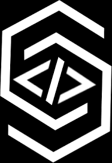

<div align="center" style="height:400px"> 
    
    <h3>DJSCE - Codeshastra 6.0</h3>
</div>

## CBT DJSCE     <br>

 <br>
    

## Team name : *CodeCrafters* :sunglasses:

  - [Problem-Statement](#Problem-Statement)
  - [Zuly Chatbot](#Zuly-Chatbot?)
  - [Solution](#Solution)
  - [System Architecture](#System-Architecture)
  - [Tech stack](#Tech-stack)
  - [Requirements](#Requirements)
  - [Folder Structure](#Folder-Structure)
  - [You tube video](#You-tube-video)
  - [Contributors](#Contributors)


## Problem Statement

Design a system that would help an individual to overcome his Mental disorder by exploring parameters like tracking anxiety
levels, stress levels and physical and mental tiredness.
CBT (Cognitive behavioral therapy) is commonly used to
treat a wide range of disorders, including phobias, addictions,
depression, and anxiety. Use CBT techniques and methods
along with Machine Learning or Artificial intelligence and
provide solutions.
Also,a chatbot to deal with the above problem would be
appreciated.

## Zuly Chatbot

<div align="center" style="height:400px"> 
    
</div>

## Solution
This project was made within 24 hours at the DJSCOE Hackathon.
The problem statement chosen was to build a CBT based solution for helping users to deal with depression, anxiety, phobia, etc.

We developed a web-based portal for the same.

The user is presented with a chatbot interface where the zuly presents a set of questions to determine whether the person is under depression or anxiety and the scale of it.
The quiz is based on NHS's mental health and well-being mood self-assessment test 
 : [NHS mood self assessment](https://www.nhs.uk/conditions/stress-anxiety-depression/mood-self-assessment/) :page_with_curl:

The results of the quiz are then shared with the user, along with helpful tips to deal with it as per the user's response.

The user can also play a game which has series of questions, based on every response that the user enters, the next question is chosen. This helps to narrow down to the actual problem faced by the user. If the user digresses from his previous responses, a fresh set of questions are presented as per his response. 

Based on the response for each question, user is suggested with tips that are not only comforting but also that encourage him/her to face the problem.

## Tech stack

:one: **Client Side** :  ReactJs , React Hooks , Highcharts react, Semantic UI React.

:two: **Server Side** :  Flask, Node JS.

:three: **ML Model** :  tflearn , tensorflow , nltk , Deep neural network (DNN).

:four: **Database and Storage** : Firebase Cloud Firestore.

## Requirements

Node and python package required is present [Here](https://gist.github.com/hritik5102/7b5f5737de12605b0df665eec2fbed70)

## Clone git repository

```sh
    $ Git clone "https://github.com/Hackit-2-0/CBT-DJSCOE.git"
```

## Folder Structure

:open_file_folder: CBT-DJSCE<br>

&nbsp;&nbsp;&nbsp;&nbsp;&nbsp;&nbsp;&nbsp;&nbsp;:open_file_folder: assets.<br>
&nbsp;&nbsp;&nbsp;&nbsp;&nbsp;&nbsp;&nbsp;&nbsp;&nbsp;&nbsp;&nbsp;&nbsp;&nbsp;&nbsp;&nbsp;&nbsp;:file_folder: images.<br><br>

&nbsp;&nbsp;&nbsp;&nbsp;&nbsp;&nbsp;&nbsp;&nbsp;:open_file_folder: cbt.<br>               
&nbsp;&nbsp;&nbsp;&nbsp;&nbsp;&nbsp;&nbsp;&nbsp;&nbsp;&nbsp;&nbsp;&nbsp;&nbsp;&nbsp;&nbsp;&nbsp;:file_folder: node_modules<br>
&nbsp;&nbsp;&nbsp;&nbsp;&nbsp;&nbsp;&nbsp;&nbsp;&nbsp;&nbsp;&nbsp;&nbsp;&nbsp;&nbsp;&nbsp;&nbsp;:file_folder: public <br>
&nbsp;&nbsp;&nbsp;&nbsp;&nbsp;&nbsp;&nbsp;&nbsp;&nbsp;&nbsp;&nbsp;&nbsp;&nbsp;&nbsp;&nbsp;&nbsp;:file_folder: src <br>
&nbsp;&nbsp;&nbsp;&nbsp;&nbsp;&nbsp;&nbsp;&nbsp;&nbsp;&nbsp;&nbsp;&nbsp;&nbsp;&nbsp;&nbsp;&nbsp;:page_facing_up: .gitignore <br>
&nbsp;&nbsp;&nbsp;&nbsp;&nbsp;&nbsp;&nbsp;&nbsp;&nbsp;&nbsp;&nbsp;&nbsp;&nbsp;&nbsp;&nbsp;&nbsp;:page_facing_up: package.json <br>
&nbsp;&nbsp;&nbsp;&nbsp;&nbsp;&nbsp;&nbsp;&nbsp;&nbsp;&nbsp;&nbsp;&nbsp;&nbsp;&nbsp;&nbsp;&nbsp;:page_facing_up: ReadMe.md <br><br>

&nbsp;&nbsp;&nbsp;&nbsp;&nbsp;&nbsp;&nbsp;&nbsp;:open_file_folder: server. <br>              
&nbsp;&nbsp;&nbsp;&nbsp;&nbsp;&nbsp;&nbsp;&nbsp;&nbsp;&nbsp;&nbsp;&nbsp;&nbsp;&nbsp;&nbsp;&nbsp;:open_file_folder: models.<br>               
&nbsp;&nbsp;&nbsp;&nbsp;&nbsp;&nbsp;&nbsp;&nbsp;&nbsp;&nbsp;&nbsp;&nbsp;&nbsp;&nbsp;&nbsp;&nbsp;&nbsp;&nbsp;&nbsp;&nbsp;&nbsp;&nbsp;&nbsp;&nbsp;:open_file_folder: chat.<br>
&nbsp;&nbsp;&nbsp;&nbsp;&nbsp;&nbsp;&nbsp;&nbsp;&nbsp;&nbsp;&nbsp;&nbsp;&nbsp;&nbsp;&nbsp;&nbsp;&nbsp;&nbsp;&nbsp;&nbsp;&nbsp;&nbsp;&nbsp;&nbsp;&nbsp;&nbsp;&nbsp;&nbsp;&nbsp;&nbsp;&nbsp;&nbsp;:page_facing_up: bot.py. <br>
&nbsp;&nbsp;&nbsp;&nbsp;&nbsp;&nbsp;&nbsp;&nbsp;&nbsp;&nbsp;&nbsp;&nbsp;&nbsp;&nbsp;&nbsp;&nbsp;&nbsp;&nbsp;&nbsp;&nbsp;&nbsp;&nbsp;&nbsp;&nbsp;&nbsp;&nbsp;&nbsp;&nbsp;&nbsp;&nbsp;&nbsp;&nbsp;:page_facing_up: classification.py.<br>
&nbsp;&nbsp;&nbsp;&nbsp;&nbsp;&nbsp;&nbsp;&nbsp;&nbsp;&nbsp;&nbsp;&nbsp;&nbsp;&nbsp;&nbsp;&nbsp;&nbsp;&nbsp;&nbsp;&nbsp;&nbsp;&nbsp;&nbsp;&nbsp;&nbsp;&nbsp;&nbsp;&nbsp;&nbsp;&nbsp;&nbsp;&nbsp;:page_facing_up: data.pickle.<br>
&nbsp;&nbsp;&nbsp;&nbsp;&nbsp;&nbsp;&nbsp;&nbsp;&nbsp;&nbsp;&nbsp;&nbsp;&nbsp;&nbsp;&nbsp;&nbsp;&nbsp;&nbsp;&nbsp;&nbsp;&nbsp;&nbsp;&nbsp;&nbsp;&nbsp;&nbsp;&nbsp;&nbsp;&nbsp;&nbsp;&nbsp;&nbsp;:page_facing_up: model.json.<br>
&nbsp;&nbsp;&nbsp;&nbsp;&nbsp;&nbsp;&nbsp;&nbsp;&nbsp;&nbsp;&nbsp;&nbsp;&nbsp;&nbsp;&nbsp;&nbsp;&nbsp;&nbsp;&nbsp;&nbsp;&nbsp;&nbsp;&nbsp;&nbsp;&nbsp;&nbsp;&nbsp;&nbsp;&nbsp;&nbsp;&nbsp;&nbsp;:page_facing_up: server.py.<br><br>

**Render React UI**

```sh
$ cd cbt

Install node_modules

$ npm i   

Runs the app in the development mode.
Open http://localhost:3000 to view it in the browser.

$ npm start 
```

**Run ML model and Start Flask server**

```sh

$ cd server
$ cd models
$ cd chat
$ python bot.py
$ python classfication.py
$ python server.py

```

Licensed under the [MIT License](LICENSE) 

## Contributors

| Name    | Email :e-mail:  |
|---------| ------------------  |
| Vedang parasnis  | vedang.parasnis@somaiya.edu|
| Priya mane  | priya.hm@somaiya.edu|
| Pratik merchant  | pratik.merchant@somaiya.edu|
| Hritik Jaiswal  | hritik.jaiswal@somaiya.edu|

<h3 align="center"><b>Developed with :heart: by <a href="https://github.com/vedangparasnis">Vedang Parasnis </a> , <a href="https://github.com/pugnator-12"> Priya mane</a> , <a href="https://github.com/pratik6725">Pratik merchant</a> and <a href="https://github.com/hritik5102">Hritik jaiswal</a>.</b></h1>

